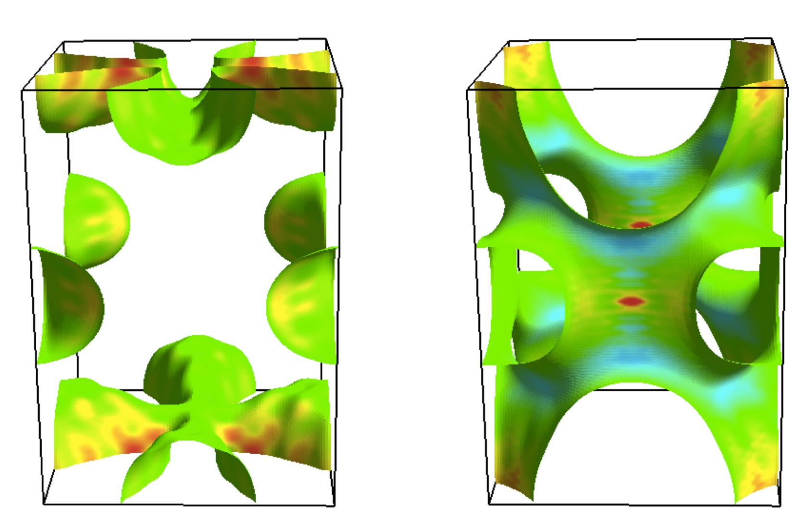

Gallery
=======

Contributions of each Fermi surfaces to the Hall effect in IrO\ :math:`_2`
(Fig. :num:`iro2`. Provided by Mr. Wataru Sano in Arita group, RIKEN)

.. _iro2:
     

            Contributions of each Fermi surfaces to the Hall
            effect in IrO\ :math:`_2` .

