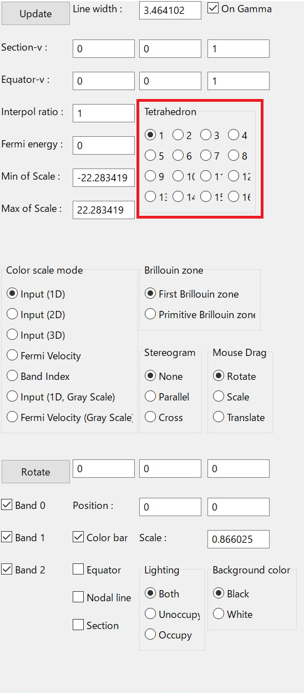

Control FermiSurfer
===================

Launch
------

For Linux, Unix, Mac
~~~~~~~~~~~~~~~~~~~~

You can launch generated executable as follows:

.. code-block:: bash

    $ fermisurfer mgb2_vfz.fs
        
You need a space between the command and input-file name.
(The sample input file ``mgb2_vfz.fs`` contains :math:`z` element of
the Fermi velocity in MgB\ :sub:`2`.)

For Windows
~~~~~~~~~~~

Click mouse right button on the input file. Choose "Open With ..." menu,
then choose ``fermisurfer.exe``.

Then, Operations are printed, and Fermi surfaces are drawn (Fig. :num:`startpng`).

.. _startpng:
     
.. figure:: ../figs/start.png
   :width: 500

   Main view.

The following operations are available:

-  Rotation of objects with mouse drag

-  Expand and shrink with mouse wheel

-  Window re-sizing

-  Moving objects with cursor keys (wasd for Windows)

-  Opeerate by using the panel

Here, I will explain all menus.

.. note::

   Some operations are not applied immidiately, and
   after th "Update" button is pushed they are applied.
   Such operations are refered as "Update required".

Background color
----------------

The background color is specified as RGB.

.. _backgroundpng:
     
.. figure:: ../figs/background.png
   :width: 500

Line width
----------

Modify the width of the Brillouin-zone boundary, the nodal line, etc.
   
Line color
----------

The line color is specified with RGB.

.. _linecolorpng:
     
.. figure:: ../figs/line_color.png
   :width: 500

Band
----

It makes each band enable/disable (Fig. :num:`bandpng`).

.. _bandpng:
     
.. figure:: ../figs/band.png
   :width: 600

Brillouin zone (Update required)
--------------------------------

You choose Brillouin-zone type as follows (Fig. :num:`brillouinzonepng`):

First Brillouin Zone
   The region surrounded by Bragg's planes the
   nearest to :math:`{\rm \Gamma}` point.

Primitive Brillouin Zone
   A hexahedron whose corner is the reciprocal
   lattice point.

.. _brillouinzonepng:
     
.. figure:: ../figs/brillouinzone.png
   :width: 600

   You can change the type of the Brillouin zone with
   "Brillouin zone" menu.

Number of Brillouin zone
------------------------

We can specify how many zones are displayed along each reciprocal
lattice vector.

.. _bznumberpng:
     
.. figure:: ../figs/bz_number.png
   :width: 600
   
Color bar
---------

The color bar becomes enable/disable (Fig. :num:`colorbarpng`).

.. _colorbarpng:
     
.. figure:: ../figs/colorbar.png
   :width: 600

   Toggling the color bar with "Color bar On/Off" menu.

Color scale mode (Update required)
----------------------------------

It turns color pattern on Fermi surfaces (Fig. :num:`colorscalepng`).

Input (1D) (default for the single input quatity) :
   It makes blue as the minimum on Fermi surfaces and red
   as the maximum on them.

Input (2D) (default for the double input quatity) :
   The color plot is shown with the color circle (see the figure).

Input (3D) (default for the triple input quatity) :
   The input value is shown as arrows on the Fermi surfaces.
   The color of the Fermi surfaces are the same sa "Band Index" case.

Fermi velocity (default for no input quantity)
   Compute the Fermi velocity :math:`{\bf v}_{\rm F} = \nabla_k \varepsilon_k`
   with the numerical differentiation of the energy,
   and plot the absolute value of that.
    
Band Index :
   Fermi surfaces of each band are depicted with uni-color
   without relation to the matrix element.

Input (1D, Gray), Fermi Velocity (Gray) :
   Plot with gray scale.

We can change the range of the color plot or the length of arrows
for 3D line plot by inputting into the text boxes at
"Min of Scale" and "Max of Scale", respectively.
   
.. _colorscalepng:
     
.. figure:: ../figs/colorscale.png
   :width: 700

   "Color scale mode" menu.

Color sequence for plot
-----------------------

We can specify the sequence of color plot.
"BGR" is Blue-Cyan-Green-Yellow-Red,
"CMY" is Cyan-Blue-Magenta-Red-Yellow,
"MCY" is Magenta-Blue-Cyan-Green-Yellow.

.. _barcplorpng:
     
.. figure:: ../figs/bar_color.png
   :width: 500

Equator (Update required)
-------------------------

We can draw the line where 
:math:`{\bf v}_{\rm F} \cdot {\bf k} = 0` for a vector :math:`{\bf k}`
(equator or extremal orbit). See fig. :num:`equatorpng`.
We can toggle equator with the checkbox "Equator"
(this operation doed not require the update,
and modify the direction of the tangent vector :math:`{\bf k}`
by using the textbox at "Equator-v :" (**fractional coordinate**).

.. _equatorpng:
     
.. figure:: ../figs/equator.png
   :width: 700

   Display the equator with the "Equator" menu.

Interpolation (Update required)
-------------------------------

Smooth the Fermi surface with the interpolation (Fig. :num:`interpolatepng`).
The time for the plot increases with the interpolation ratio.

.. _interpolatepng:
     
.. figure:: ../figs/interpolate.png
   :width: 700

   Modify the number of interpolation points from 1 to 4 with "Interpolate" menu.
            
Which (or both) side of Fermi surface is illuminated
----------------------------------------------------

We can choose the illuminatedside of the Fermi surface (Fig. :num:`lightpng`).

Both :
    Light both sides.

Unoccupy :
    Light unoccupied side.
   
Occupy :
    Light the occupied side.

.. _lightpng:
     
.. figure:: ../figs/light.png
   :width: 500

   Change the lighted side by using the "Lighting" menu.

Mouse Drag
----------

It turns the event of the mouse-left-drag.

Rotate(default)
   Rotate the figure along the mouse drag.

Scale
   Expand/shrink the figure in upward/downward drag.

Translate
   Translate the figure along the mouse drag.

.. figure:: ../figs/mouce.png
   :width: 200
           
Nodal line
----------

The line on which the matrix element becomes 0 (we call it nodal line)
becomes enable/disable (Fig. :num:`nodelinepng`).

.. _nodelinepng:
     
.. figure:: ../figs/nodeline.png
   :width: 500

   Toggling the node line with "Nodal line" menu.

Section of the Brillouine zone (Update required)
------------------------------------------------

Display a 2D plot of the Fermi surface (line)
on an arbitrary section of the Brillouin zone (Fig. :num:`sectionpng`).

We can toggle it with the checkbox "Section"
(this operation does not require update),
and can change the normal vector with the textbox at "Section-v :"
(**fractional coordinate**).

If the checkbox "On Gamma" is turned on,
the section crosses :math:`\Gamma` point.

.. _sectionpng:
     
.. figure:: ../figs/section.png
   :width: 700

   Display 2D plot of the Fermi surface (line) with "Section" menu.

Output section of the Brillouine zone
-------------------------------------

Above section of the Brillouin zone and Fermi surfaces are outputted into files "fermi_line.dat" and "bz_line.dat" by pushing this button.

.. _sectionfilepng:
     
.. figure:: ../figs/section_file.png
   :width: 500

These files are plotted in gnuplot as follows:
           
.. code-block:: gnuplot

   plot "fermi_line.dat" w l, "bz_line.dat" w l

Shift Fermi energy (Update required)
------------------------------------

It shifts the Fermi energy (= 0 in default) to arbitrary value (Fig. :num:`shiftpng`).

.. _shiftpng:
     
.. figure:: ../figs/shift.png
   :width: 500

   The Fermi energy is set from 0 Ry to 0.1 Ry with
   "Shift Fermi energy" menu

Stereogram
----------

The stereogram (parallel eyes and cross eyes) becomes enabled/disabled
(Fig. :num:`stereogrampng`).

None (Default)

Parallel
   Parallel-eyes stereogram

Cross
   Cross-eyes stereogram

.. _stereogrampng:
     
.. figure:: ../figs/stereogram.png
   :width: 700

   The stereogram becomes enabled/disabled with
   "Stereogram" menu.

Tetrahedron (Update required)
-----------------------------

You change the scheme to divide into tetrahedra (``tetra # 1`` as default).
It is experimental.

           
View point
----------

Changing the view point.

Scale
    Change the size of the figure.

Position
    Change the xy position of the figure.

Rotate
    Change angles at x-, y-, z- axis.
    Rotations are performed as z-y-x axis if the "Roate" buttone is pushed.

In each menu, first the current value is printed. then a prompt to input
the new value appears (Fig. :num:`setviewpng`).

.. _setviewpng:
     
.. figure:: ../figs/setview.png
   :width: 300

   Modify the view point by using "View point" menu

Saving images
-------------

``fermisurfer`` does not have any functions to save images to a file.
Please use the screenshot on your PC.

