操作方法
========

起動
----

Linuxの場合
~~~~~~~~~~~

作成した実行可能ファイル ``fermisurfer`` にパスが通っている状態で

.. code-block:: bash

    $ fermisurfer mgb2_vfz.frmsf
        

とコマンド, スペース, 入力ファイル名とタイプします.
(サンプルファイルの中身はMgB\ :math:`_2`\ のFermi速度の :math:`z` 方向成分です. )

Windowsの場合
~~~~~~~~~~~~~

入力ファイル(この場合は ``mgb2_vfz.frmsf``)を右クリックし,
メニューから「プログラムから開く」を選択し,
実行ファイルを ``fermisurfer.exe`` に設定してください.

このあとはLinux, Windows共通です. ``fermisurfer`` が起動すると,
まずファイルから読み取った情報が出力されます.

::

   ########################################
   ##                                    ##
   ##  Welocome to FermiSurfer ver. 1.8  ##
   ##                                    ##
   ########################################
   
     Number of threads : 4

     Initialize variables ...
   
   
     ##  Brillouin zone informations  ###########
   
       k point grid : 40 40 36
       k point grid starts from Gamma.
       # of bands : 3
       bvec 1 : 1.000000 0.577350 -0.000000
       bvec 2 : 0.000000 1.154701 0.000000
       bvec 3 : 0.000000 -0.000000 0.872065
   
     ##  Max. and Min. of each bands  #######################
   
       Band   Eig_Min.      Eig_Max      Mat_Min      Mat_Max
       1     -0.428153     0.056262     -24.048639     24.048639 (1)
       2     -0.289572     0.121181     -23.320309     23.320309 (1)
       3     -0.133566     0.497620     -43.651634     43.651634 (1)
   
     ##  First Brillouin zone mode  #######
   
       band   # of patchs
       1       8824  (2)
       2       29354 (2)
       3       28293 (2)
   
   
     ##  Full color scale mode #############
   
       Max. value : 22.283419  (3)
       Min. value : -22.251053 (3)
   
       band   # of nodeline
       1       632  (4)
       2       1524 (4)
       3       2268 (4)
       band   # of Fermi-line
       1       100
       2       736
       3       0
   
     ##  How to handle  ###################
   
                 mouse drag : Rotate objects
                 mousewheel : Resize objects
                  cursorkey : Move objects
         mouse right button : Menu

#. それぞれのバンドにおけるエネルギーと物理量の最小値・最大値.

#. それぞれのバンドにおけるパッチ(Fermi面を構成する平面)の数.

#. 物理量のFermi面における最大値と最小値.
   この数字がカラーバーの最大・最小に対応します.
   下の例では一番青いところが-22.283419,
   一番赤いところが22.283419となります.
   (1)で表示されているのはBrillouin領域全体のものです.

#. それぞれのバンドにおけるnode line (後述)の本数.

次に操作方法が出力され, Fermi面が描画されます(図 :num:`startpng` ).

.. _startpng:
     
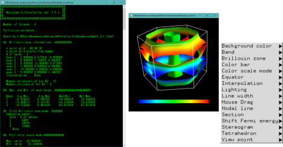

   Fermisurferを起動した直後の画面.

-  マウスのドラッグによる回転が出来ます.

-  マウスのホイールを使っての拡大・縮小が出来ます.

-  ウィンドウの大きさを変えることもできます.

-  カーソルキーを使ってウィンドウ内で上下左右に図を動かせます.

-  ウィンドウ内でマウスの右クリックをするとメニューが表示されます.

次から右クリックで表示されるメニューを説明します.

Background color
----------------

背景色を黒または白に切り替えます. Brillouin
Zoneの枠線も白/黒と切り替わります (図 :num:`backgroundpng`).

.. _backgroundpng:
     
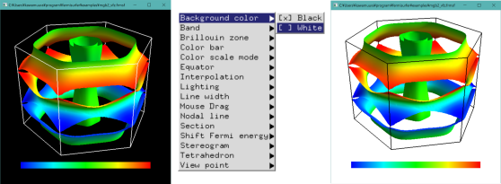

   "Background color"メニューで背景色を白/黒に切り替える.

Band
----

バンド毎の表示on/offを切り替えます(図 :num:`bandpng`).

.. _bandpng:
     
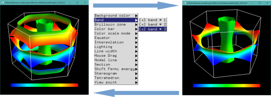

   "Band" メニューで3番目のバンドの表示/非表示を切り替える.

Brillouin zone
--------------

描画範囲をFirst Brillouin Zone/Primitive Brillouin Zoneと
切り替える事が出来ます (図 :num:`brillouinzonepng`).

Fisrst Brillouin Zone
    :math:`{\rm \Gamma}` 点から一番近いBragg面で囲まれた領域

Primitive Brillouine Zone
    逆格子ベクトルを辺とする平行6面体領域

.. _brillouinzonepng:
     
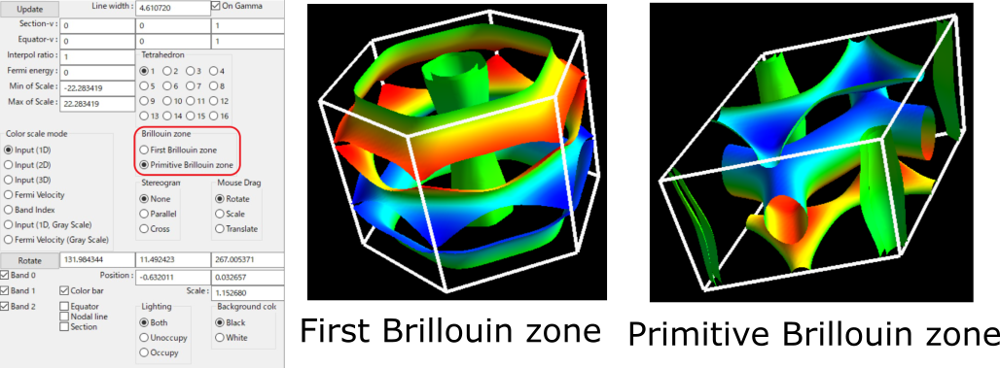

   "Brillouin zone" メニューでBrillouin領域のとり方を変更する.

Color bar
---------

カラーバーの表示/非表示を切り替えます(図 :num:`colorbarpng`).

.. _colorbarpng:
     
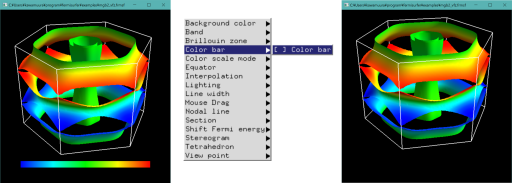

   "Color bar On/Off" メニューでカラーバーの表示/非表示を切り替える.

Color scale mode
----------------

Fermi面の色表示のさせ方を変更します(図 :num:`colorscalepng`).

Auto(デフォルト)
    カラースケールの範囲をFermi面上での物理量の最小値から最大値までとします.

Manual
    カラースケールの範囲を標準入力から設定します.

Unicolor
    物理量に関係なく, 各バンド毎に単色でFermi面を塗ります.

Periodic
    周期的な量のプロットに用います.
    物理量が 0 :math:`\rightarrow` :math:`\pi/3` 
    :math:`\rightarrow` :math:`2\pi/3` :math:`\rightarrow` :math:`\pi` :math:`\rightarrow`
    :math:`4\pi/3` :math:`\rightarrow` :math:`5\pi/3` :math:`\rightarrow` :math:`2\pi`
    と変化するに連れて 色が赤 :math:`\rightarrow` 黄 :math:`\rightarrow`
    緑 :math:`\rightarrow` シアン :math:`\rightarrow` 青:math:`\rightarrow`
    マゼンタ :math:`\rightarrow` 赤と変わります.

Fermi velocity (Auto)
    エネルギーの差分からFermi速度 :math:`{\bf v}_{\rm F} = \nabla_k \varepsilon_k`
    を計算し, その絶対値をカラープロットする.
    カラースケールの範囲はFermi面上での :math:`|{\bf v}_{\rm F}|`
    の最小値から最大値までとする.
    
Fermi velocity (Manual)
    エネルギーの差分からFermi速度 :math:`{\bf v}_{\rm F} = \nabla_k \varepsilon_k`
    を計算し, その絶対値をカラープロットする.
    カラースケールの範囲は標準入力から設定する.

Gray scale (Manual), Gray scale (Auto)
    黒色の濃淡でプロットする.

.. _colorscalepng:
     
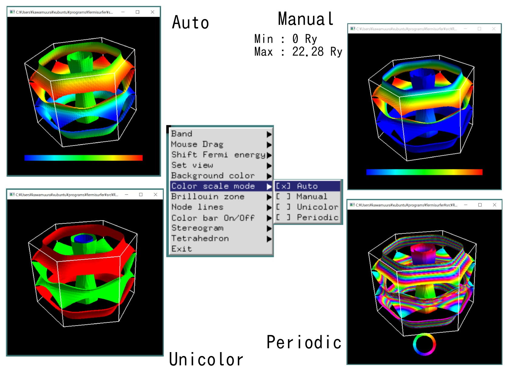

   "Color scale mode" メニュー.

Equator
-------

ある :math:`{\bf k}` に対して,
:math:`{\bf v}_{\rm F} \cdot {\bf k} = 0` となる線を表示します
(図 :num:`equatorpng`).
   
Equator
   Equatorの表示・非表示を切り替えます.

Modify equator
   :math:`{\bf k}` を指定します. コンソールの

   ::

       New Miller index : 

   の後に :math:`{\bf k}` ベクトル(フラクショナル座標)を入力してください.
       
.. _equatorpng:
     
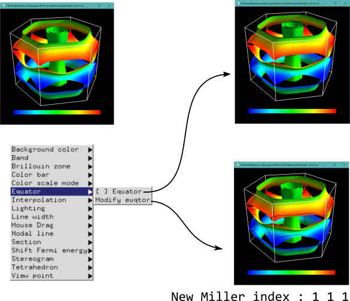

   "Equator"メニューで Fermi面の赤道(Equator)を表示する.

Interpolation
-------------

補間により図の曲面を滑らかにします (図 :num:`interpolatepng`).
コンソールの

::

   New interpolation ratio :

の後に分点数を入力してください. ただし分点数を増やすと描画にかかる時間も増えます.

.. _interpolatepng:
     
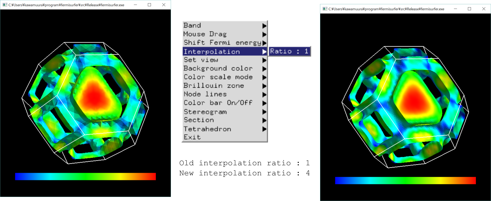

   "Interpolate"メニューで 分点数を1から4に変える.

Lighting
--------

光を当てる面を変更します (図 :num:`lightpng`).

Both side
    Fermi面の表裏両面に光を当てます.

Unoccupied side
    非占有領域側のみに光を当てます.
   
Occupied side
    占有領域側のみに光を当てます.

.. _lightpng:
     
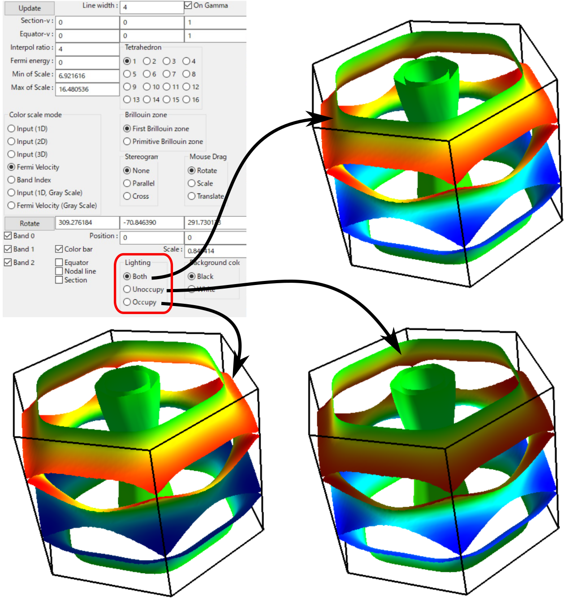

   "Lighting"メニューで光を当てるFermi面を変更する.

Line width
----------

ブリルアンゾーンの境界やノーダルライン等の線幅を変更します.
   
Mouse Drag
----------

マウスの左ボタンドラッグを行った時の動作を変更します.

Rotate(デフォルト)
    ドラッグをした方向に図形を回転させます.

Scale
    上方にドラッグすると図形を拡大,
    下方にドラッグすると図形を縮小します.

Translate
    ドラッグした方向に図形を動かします.

Nodal line
----------

物理量が0となるところに引く線(ノーダルライン)のOn/Offを切り替えます(図 :num:`nodelinepng`).

.. _nodelinepng:
     
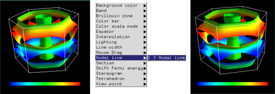

   "Nodal line" メニューでnodal lineの表示/非表示を切り替える.

Section
-------

Brillouin領域を任意の断面で切り取り,
2次元のFermi面(線)を描画します (図 :num:`sectionpng`).
   
Section
   断面の表示・非表示を切り替えます.

Modify Section
   断面を指定します. コンソールの

   ::

       New Miller index : 

   の後に法線ベクトル(フラクショナル座標)を入力してください.
   断面は法線ベクトルの先端を通ります.
       
Modify Section (across Gamma)
   断面を指定します. コンソールの

   ::

       New Miller index : 

   の後に法線ベクトル(フラクショナル座標)を入力してください.
   断面は :math:`\Gamma` 点を通ります.

.. _sectionpng:
     
.. figure:: ../figs/section.png

   "Section" メニューでFermi面の断面を表示する.

Shift Fermi energy
------------------

Fermiエネルギー(デフォルトでは0)を任意の値にずらします.
このメニューを選択すると次のようにインプット中の最小のエネルギー,
最大のエネルギー, 現在のFermiエネルギーが標準出力として表示されます.

::

    Min  Max  E_F 
    -0.428153 0.497620 0.000000 
    Fermi energy shift : 
        

次に新しいFermiエネルギーを入力すると, Fermi面が再描画されます (図 :num:`shiftpng`).

.. _shiftpng:
     
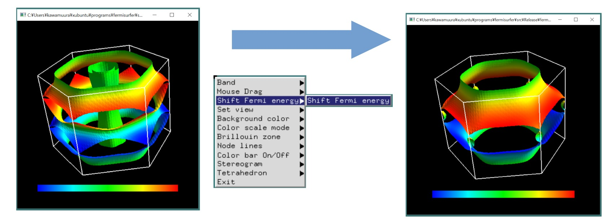

   "Shift Fermi energy"メニューで Fermi エネルギーを0.0 Ryから0.1 Ryに変える.

Stereogram
----------

裸眼立体視用の図の表示/非表示を切り替えます(図 :num:`stereogrampng`).

None (デフォルト)
    立体視を無効にします.

Parallel
    平行法用の図を表示します.

Cross
    交差法用の図を表示します.

.. _stereogrampng:
     
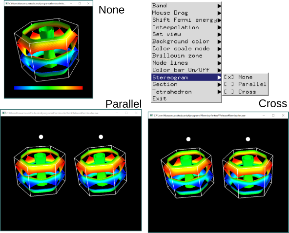

   "Stereogram" メニューで立体視用画像を表示する.

Tetrahedron
-----------

四面体の切り方を変えます(デフォルトは ``tetra # 1``).
図が綺麗になる可能性がありますが,
多くの場合は逆に図がギザギザして汚くなるようです.

View point
----------

視点を変更します.

Scale
    図形のサイズを指定します.

Position
    図形の上下位置を指定します.

Rotation
    x,y,z軸周りの回転角を指定します.回転操作はz軸-y軸-x軸の順で行われます

それぞれのメニューを選択すると, はじめに現在の値が表示され,
その後変更後の値を入れるプロンプトが現れます(図 :num:`setviewpng`).

.. _setviewpng:
     
.. figure:: ../figs/setview.png
   :width: 70%

   "View point"メニューで 視点を変更する.

画像の保存方法
--------------

``fermisurfer`` には画像をファイル出力する機能はありません.
お使いのPCにあった方法でスクリーンショットを取得して
(``Printscreen`` キーを押すなど)
ペイントブラシやgimpで編集して画像を作成してください.

